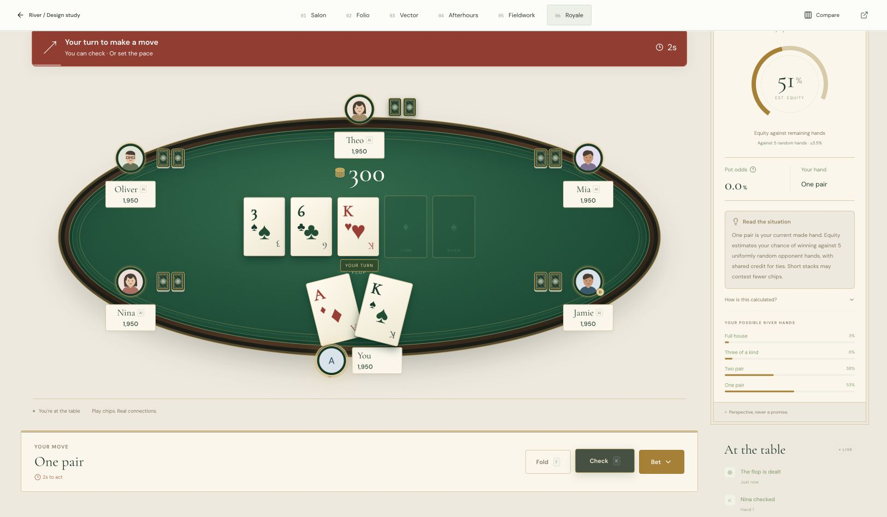

<div align="center">

# River
### Poker, in good company.

Private browser poker for friends. Six distinct design directions. One shared game.

[Play River](https://river-private-poker.vercel.app) · [Explore the designs](https://river-private-poker.vercel.app/directions?direction=royale) · [Setup](docs/SETUP.md) · [Architecture](docs/ARCHITECTURE.md)

</div>



River is a modern interpretation of the poker night: private Texas Hold’em rooms, readable cards, clear turn cues, an optional probability companion, and thoughtful match review. Play with 2–8 friends or practice against computer opponents. All chips are virtual; there are no deposits, purchases, or cash prizes.

## What you can do

- Create a private room and invite friends with a code or link.
- Practice against clearly labeled bots that act through the same authoritative game system.
- Switch visual directions during a hand without replacing the game or room.
- Explore equity, pot odds and possible outcomes using only the cards you can see.
- Review hands, sessions, chip results and a playing fingerprint with sample-aware statistics.
- Customize sound, assistant visibility, motion and appearance; recover your guest profile on another browser.

## Six different products, one poker engine

| Direction | Character | Explore |
| --- | --- | --- |
| Salon | An intimate private club: quiet, warm and refined | [Open](https://river-private-poker.vercel.app/directions?direction=salon) |
| Folio | An editorial composition led by typography | [Open](https://river-private-poker.vercel.app/directions?direction=folio) |
| Vector | Precise controls and clear, data-conscious hierarchy | [Open](https://river-private-poker.vercel.app/directions?direction=vector) |
| Afterhours | A cinematic table with atmospheric lighting | [Open](https://river-private-poker.vercel.app/directions?direction=afterhours) |
| Fieldwork | An unconventional but usable spatial composition | [Open](https://river-private-poker.vercel.app/directions?direction=fieldwork) |
| Royale | A casino-inspired table with restrained gold details | [Open](https://river-private-poker.vercel.app/directions?direction=royale) |

[View the screenshot gallery](docs/SHOWCASE.md) · [Read the design study](DESIGN-DIRECTIONS.md)

## Run in five minutes

Use **Node.js 24**.

```sh
git clone https://github.com/deadpoods/river-poker.git
cd river-poker
npm ci
npm run dev
```

Open **http://localhost:3000**. Local development uses PostgreSQL through PGlite and persists data in `.river-data/`. No cloud credentials are needed to try the app locally. For Supabase and Vercel, follow [the deployment guide](docs/SETUP.md).

## Built with

Next.js 16 App Router · React 19 · TypeScript · PostgreSQL · postgres.js · Supabase · Vercel · PGlite

The server owns turns, legal actions, private cards and settlements. Room transactions use row locks, command receipts prevent duplicate actions, and server-sent events deliver a private projection to each player. Five protected database tables persist profiles, sessions, rooms, membership and rate limits.

## Verified behavior

**28 automated checks** cover the rules, evaluation, side pots, privacy, timeouts, assistant calculations, sound events, playstyle statistics, persistence, concurrency and database access protection. Preview and production verification also exercised full multiplayer hands, recovery and history. A cloud practice hand with three bots completed with conserved chips and persisted history.

```sh
npm run typecheck
npm test
npm run build
```

[Testing and live verification](docs/TESTING.md) · [Security](SECURITY.md) · [Contributing](CONTRIBUTING.md)

## Current limits

This is a playable project, not a measured large-scale poker service. Live updates currently poll durable state; a busy deployment should add managed event fan-out and measure traffic. The assistant samples uniformly random opponent hands and does not infer actual ranges. Bluff tendency is a labeled statistical proxy, not a claim to know intent. Supabase Free has usage and inactivity limits.

The production database started fresh with Supabase. Earlier Neon profiles and history remain preserved in Neon and were not imported because its exhausted quota prevented export.

## License

A project license has not been selected. Public source availability does not grant a general reuse license. Third-party dependencies and fonts retain their respective licenses.
