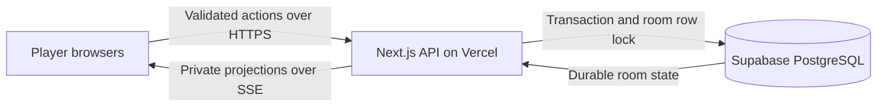

# River

**Poker, in good company.** Private Texas Hold’em for 2–8 players, with play chips, persistent profiles, a quiet mathematics assistant, and detailed session review.

River uses an original editorial visual system: warm ivory, blue slate, sage, copper, Instrument Serif, Manrope, custom cards, illustrated practice opponents, and a physical elliptical table. Mobile moves the seats around a taller table, brings your cards forward, and places the actions above the bottom navigation. Motion uses transforms and opacity, with both system and profile settings for reduced motion. Sound is optional and off by default.

## Run locally

Use Node.js 24. The deployed runtime is pinned to this tested major version.

```sh
npm ci
npm run dev
```

Without a database URL, development uses real PostgreSQL through PGlite, persisted in `.river-data/`. Restarting the application preserves profiles, rooms, and history. This local adapter is disabled on Vercel.

For the connected cloud database, link to the existing Vercel project and pull its development environment:

```sh
vercel link --project river-private-poker --scope deadpoods
vercel env pull .env.local --yes
npm run db:setup
npm run dev
```

Alternatively, set `DATABASE_URL` in `.env.local` to a pooled PostgreSQL connection. The server validates TLS certificates for remote connections. Never prefix database credentials with `NEXT_PUBLIC_` or commit environment files.

## Play

Your first visit creates a persistent guest profile and an undealt practice table. Deal when you are ready; the five illustrated opponents are explicitly marked as AI.

To play with friends, choose **Create a table**, set the seat count, starting stack, blinds, and turn timer, then share the room code or invitation link. Everyone marks themselves ready before the host deals. Joining a started session is limited to existing players. The host starts subsequent hands and ends the session between hands. Stacks carry between hands; there are no purchases or real-money balances.

Your browser keeps an HTTP-only session cookie. **Profile → Preferences → Create a recovery key** lets you restore the same profile on another browser. Treat that key as a password: anyone who has it can access your profile. Recovery is an explicit guest identity mechanism; this version does not use email or social sign-in.

Name and color changes update your seats at active tables. Past hand records retain the identity used when those hands were played. Preference changes are merged under a profile row lock so simultaneous edits cannot discard each other.

During your turn, Fold, Check/Call, and Raise show the server’s current legal actions. The raise amount is the total wager for that betting round, not an additional increment. Desktop shortcuts are F, K/C, and R; shortcuts do not act while typing or using a dialog. A timeout checks when legal and folds when facing a wager.

History includes your cards, public board, showdown information, betting timeline, results, player totals, and a shortcut to the largest pot. Other players’ folded or uncontested cards remain private. Session history remains available after leaving the live table. JSON export uses the versioned `river-hand-history-v1` format as the basis for a future animated replay.

## Deployment and external infrastructure

The live app is [river-private-poker.vercel.app](https://river-private-poker.vercel.app). The six-direction refinement uses one shared game system. The Supabase migration passed the optimized Vercel build, 28 automated checks, and preview plus public production multiplayer verification, including private projections, concurrent commands, hand completion, statistics, history, and profile recovery. The published site also passed a complete practice hand with three bots, chip conservation and persisted history.

The linked project is **river-private-poker** in the **deadpoods** Vercel workspace. **Supabase PostgreSQL** is the Supabase PostgreSQL project on the Free plan in Singapore. Vercel Functions also run in `sin1`. Free-plan storage, transfer and inactivity limits still apply; no paid upgrade was selected.

Supabase PostgreSQL is the external durable infrastructure. Vercel hosts Next.js, the authoritative API, and bounded server-sent event streams. It does not act as an always-running game server, and no state depends on function memory.



Each action locks its room row, validates the current turn and wager, advances the game, records the command receipt, and commits atomically. Duplicate commands are applied once. The deck, shuffle seed, and other players’ hidden cards never enter the client projection. Shuffling uses cryptographic randomness; the pure rules engine accepts reproducible fixtures for tests.

Each player’s SSE stream observes shared database state roughly every second, sends versioned projections, and reconnects before the function duration limit. Full archives are requested separately rather than broadcast on every update. After a lost connection, clients back off, refresh the current snapshot, and ignore older versions. Presence is refreshed during streams; play continues after a disconnected player’s deadline. Bots and deadlines are persisted timestamps, advanced under the room lock when a request or stream observes the room. If all players close the app, the next observer catches up elapsed deadlines instead of granting fresh timers. There is no continuous background scheduler.

Unfinished rooms expire after 48 hours without activity. A session supports up to 300 hands. Completed history is retained. These limits bound individual room documents; lifetime analytics use all of the profile’s sessions and display the latest 100 completed hands in the trend chart.

Deploy a review preview with:

```sh
npm run typecheck
npm test
npm run build
vercel deploy --yes --scope deadpoods
```

`DATABASE_URL` is a server-only Vercel Secret containing the dedicated `river_server` transaction-pooler connection. `DATABASE_SSL_CA` contains Supabase’s downloaded root certificate; the driver verifies certificates and hostnames and disables prepared statements for transaction pooling. Development, Preview, and Production currently share the new database. Cloud requests fail clearly if the connection is missing, rather than switching to local or ephemeral storage. Vercel Deployment Protection remains enabled for protected deployment URLs; the canonical production address above is public. Use the existing signed-in Vercel browser or the CLI’s authenticated access to inspect a protected preview. Before a broader rollout, separate preview and production databases and measure expected simultaneous-room traffic. To publish a tested update to the existing production app, use `vercel deploy --prod --yes --scope deadpoods`.

## Assistant calculations

The optional assistant uses only your own cards and the visible board. It samples 800 possible opponent deals and runouts from the unseen deck. Opponent hands are uniformly random; this version does not infer a player’s range from their behavior.

- Equity divides winning credit among ties against all remaining hands. The displayed sampling margin is an approximate 95% interval, not a guarantee or a range-model accuracy claim.
- Draw outs combine direct straight and flush completion cards without double-counting. The two-card completion calculation uses the exact unseen-card denominators. Completing a draw may still lose the hand.
- Pot odds use the chips you are eligible to contest. Call EV averages simulated payouts across eligible main and side pots, then subtracts the call. Short all-in stacks are excluded from pots they cannot win.
- EV assumes no additional bets or folds. Position, future action, and actual opponent ranges can materially change a decision. The interface explains the calculation and the assumptions.

## Verification

```sh
npm run typecheck
npm test
npm run build
node --import tsx scripts/verify-multiplayer.ts
```

The 20 automated tests cover all hand categories and kickers, 600 evaluator comparisons, betting order, the big blind’s option, short all-ins and cumulative reopening, side pots, unmatched refunds, tied pots and odd chips, privacy, timeouts, elapsed-deadline catch-up, assistant math, input checks, and PostgreSQL persistence/rollback/concurrency. Another 500 randomized multi-player hands check chip conservation, card uniqueness, valid turns, and termination.

The HTTP verification creates isolated profiles and checks identity updates at live tables, simultaneous preference saves, ready/start permissions, room capacity, private SSE projections, concurrent duplicate actions, stale-action rejection, a full hand, results, profile statistics, recovery, and history access after leaving. It is an integration check, not a load test.

To run that check against the same project’s protected Vercel Preview, first refresh the development environment, then set:

```sh
RIVER_VERIFY_URL=https://YOUR-EXACT-PREVIEW.vercel.app \
RIVER_VERIFY_USE_VERCEL_OIDC=1 \
node --import tsx scripts/verify-multiplayer.ts
```

The script loads the short-lived token privately and attaches it only to a Vercel URL. It never prints the token or includes it in the source download.

## Source map

| Area                                                           | Files                        |
| -------------------------------------------------------------- | ---------------------------- |
| Rules, legal actions, turn advancement, settlement, projection | `src/lib/poker/engine.ts`    |
| Hand evaluation and deck helpers                               | `src/lib/poker/evaluator.ts` |
| Probability and EV estimates                                   | `src/lib/poker/assistant.ts` |
| PostgreSQL schema, connection, rate limits                     | `src/lib/server/db.ts`       |
| Room transactions, membership, history, analytics              | `src/lib/server/rooms.ts`    |
| Guest sessions and recovery                                    | `src/lib/server/auth.ts`     |
| API routes and bounded streams                                 | `src/app/api/`               |
| Table, dialogs, assistant, profiles and history                | `src/components/`            |
| Visual tokens, spatial layout, motion and responsive rules     | `src/app/globals.css`        |

For higher concurrency, replace per-client database polling with a managed pub/sub fan-out service while retaining the same transactional authority and private projections. Measure real simultaneous-room traffic before assigning a capacity claim. Full replay, modeled opponent ranges, and email identity are extension points rather than features claimed by this release.


## Six design directions

Explore the [live comparison gallery](https://river-private-poker.vercel.app/directions): Salon (Private Club), Folio (Modern Editorial), Vector (Neo-Fintech), Afterhours (Cinematic Table), Fieldwork (Experimental Minimal), and Royale (Grand Casino). These are working presentation alternatives using one shared game and multiplayer system. Switch between them during the same hand, then use Compare to read the assessment and recommendation. All directions use the Supabase-backed service; the isolated local preview remains available.

The current interface remains the default at `/`. Its table and cards have been enlarged following the review. No new direction has been committed as the permanent identity. Individual directions use `/directions?direction=salon` (or `folio`, `vector`, `afterhours`, `fieldwork`, `royale`).

Read [DESIGN-DIRECTIONS.md](DESIGN-DIRECTIONS.md) for the reasoning, references, full component decisions, critical comparison and next recommended iteration. Preview images live in `public/directions/`.


The refinement adds 20 distinct audio cues, a table-header sound preview and volume control, prominent turn announcements and a warning near the end of your timer, darker folded/eliminated seats, a separate large result ribbon, and meaningful deal/wager/result/hover animations. Afterhours has smoother lighting and surfaces. Use the Day/Night button to change each other direction, including Original; the preference is remembered separately for each design on this device. Afterhours remains dark.

Open Sound settings at the top of the table, turn sounds on, and tap a preview to activate browser audio. The panel reports audio readiness. Existing mute preferences are preserved. A first real tap/click or key gesture unlocks the reusable audio context; old events on page load are silent. Mute stops scheduled sources, and system/profile reduced-motion preferences disable visual effects.

The profile now shows a playing fingerprint and eight observed metrics with sample sizes and definitions. Bluff tendency is explicitly inferred from high-card post-flop raises, including draws; it does not claim to know intent or opponents’ private cards. All / Friends / Practice filters continue to apply. Read DESIGN-DIRECTIONS.md for measurement details and refinement validation.


The October 9 transfer fix reduces live database reads to small version/deadline/presence probes and fetches only the latest hand for updates. Older hand histories stay preserved in PostgreSQL. A 250-hand regression check, all 27 automated checks and local production multiplayer verification pass. The user subsequently authorized a fresh Supabase database while keeping Neon intact. Neon could not be exported because its exhausted quota blocked read access. Existing Neon profiles, recovery keys and history were not copied; they remain on Neon for a later migration when access is restored. Returning browsers receive new Supabase-backed profiles. No old database, table or room was deleted.


### Supabase access model

The dedicated `river_server` login has no superuser, role-creation, database-creation, replication or RLS-bypass privilege. It can connect and create River tables in the public schema and owns those tables. The existing River API performs player authorization. All five River tables enable row-level security and deny direct access to `anon` and `authenticated`; no browser database keys are needed. The owner can still perform server transactions. Supabase’s [RLS-enabled/no-policy informational notice](https://supabase.com/docs/guides/database/database-linter?lint=0008_rls_enabled_no_policy) is expected: browser roles have no policies because they must not query these tables directly.

Run `RIVER_VERIFY_URL=https://river-private-poker.vercel.app node --import tsx scripts/verify-multiplayer.ts` for the public production flow, and `RIVER_VERIFY_URL=https://river-private-poker.vercel.app node --import tsx scripts/verify-bots.ts` for a real four-seat practice hand with three bots. These checks create their own verification profiles and rooms.
