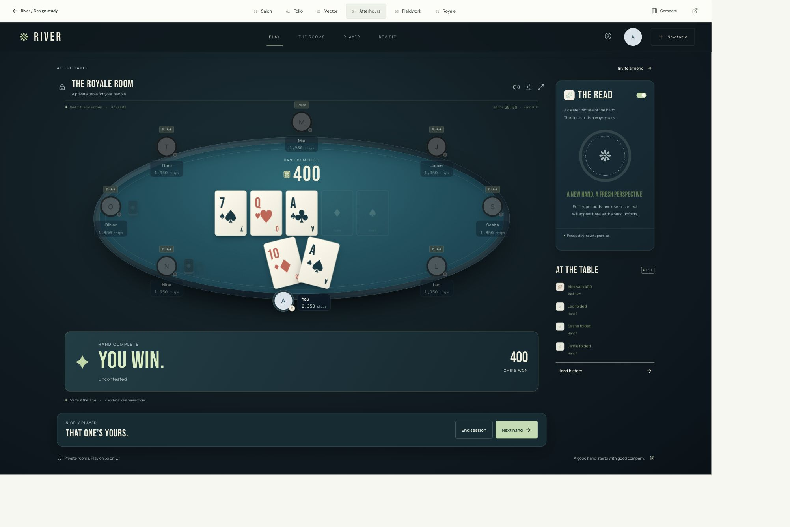
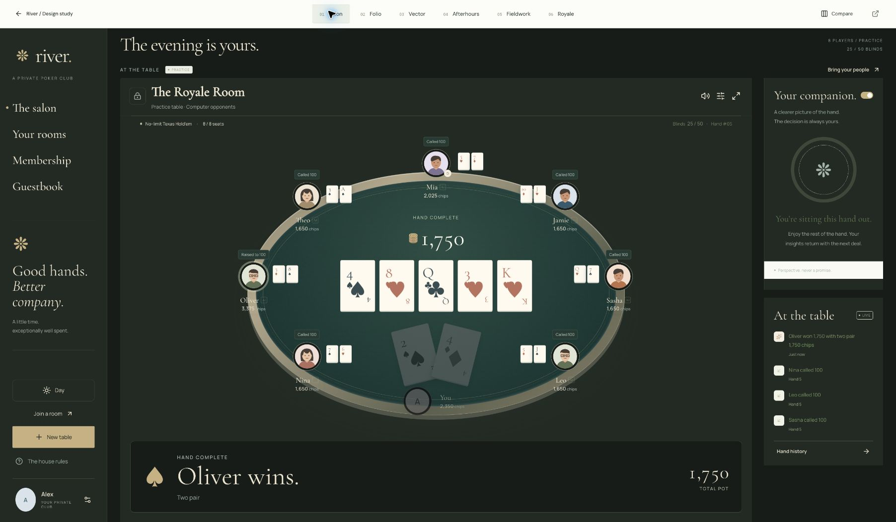
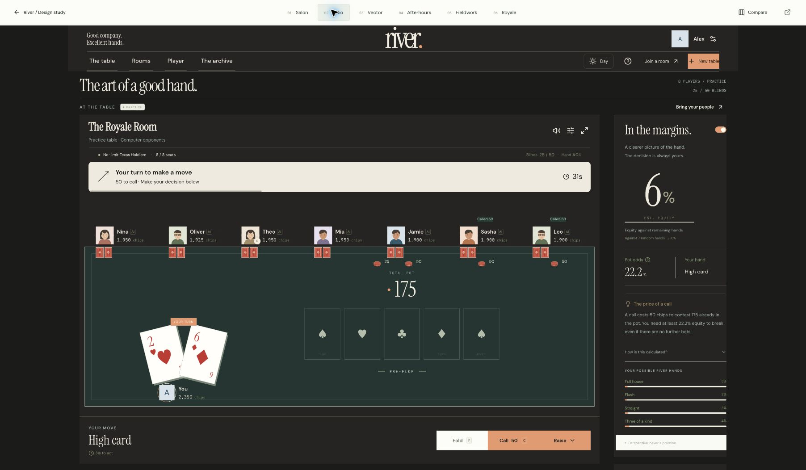
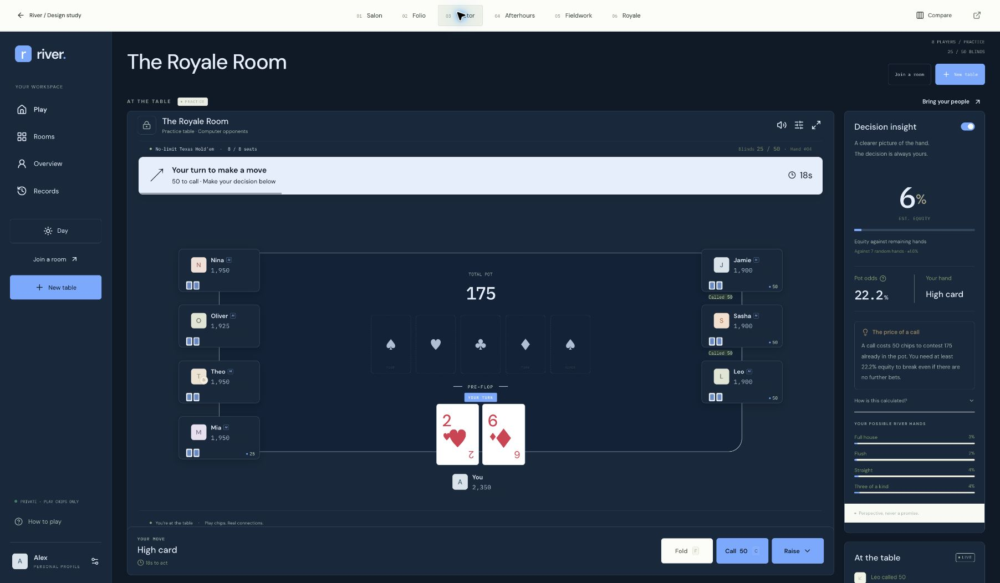
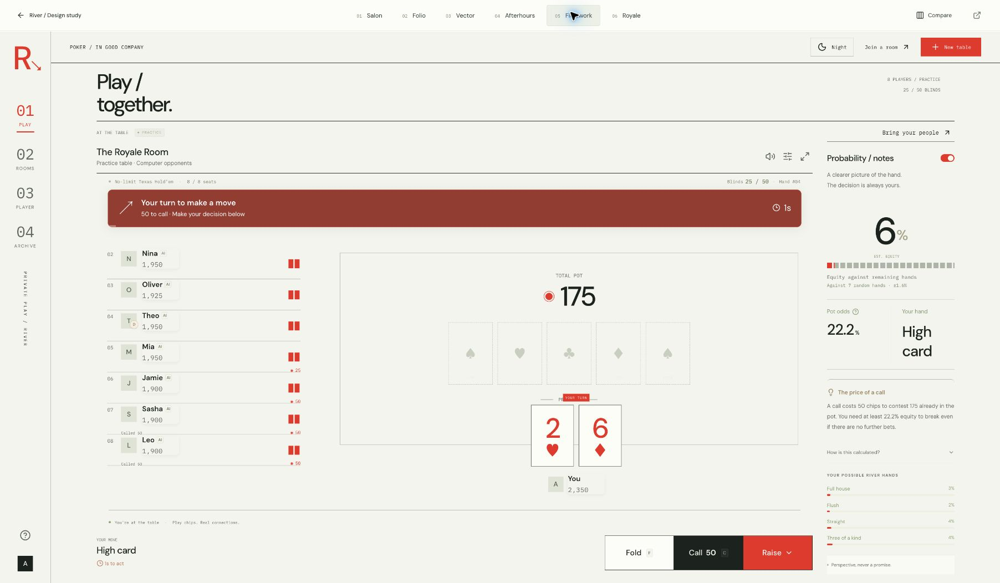
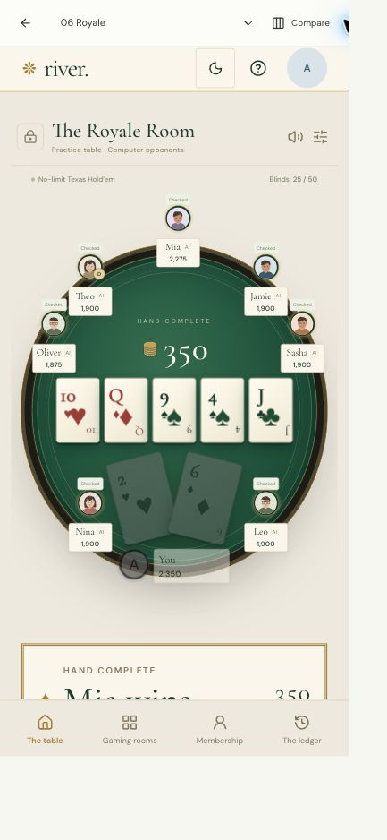
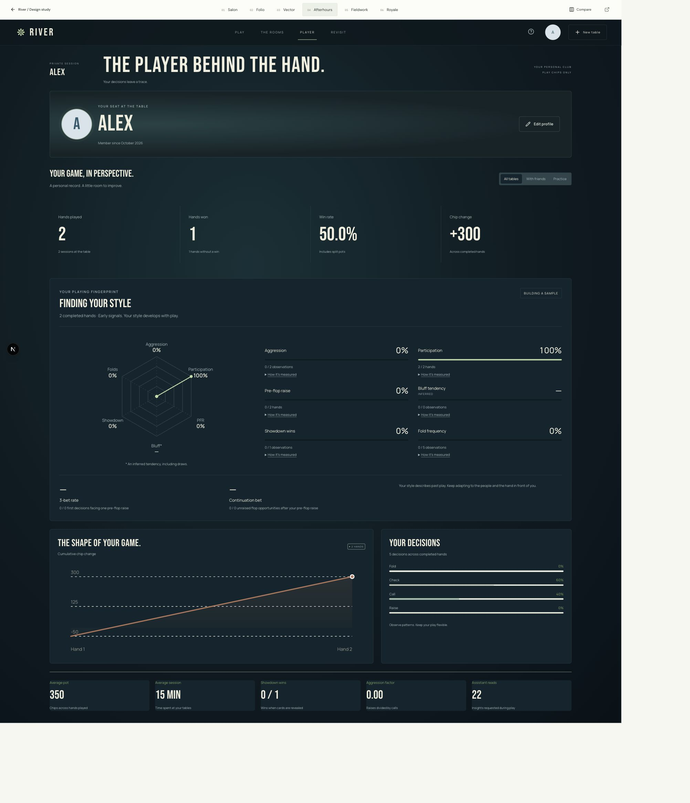

# River — six design directions

These screenshots show working interfaces with a shared engine and shared multiplayer API. They are product captures, not proposed mockups. The design study remains open; no permanent direction has been chosen.

## Royale

## Afterhours

## Salon

## Folio

## Vector

## Fieldwork

## Mobile

## Playing fingerprint

[Play River](https://river-private-poker.vercel.app/directions?direction=royale) · [Back to README](../README.md)
